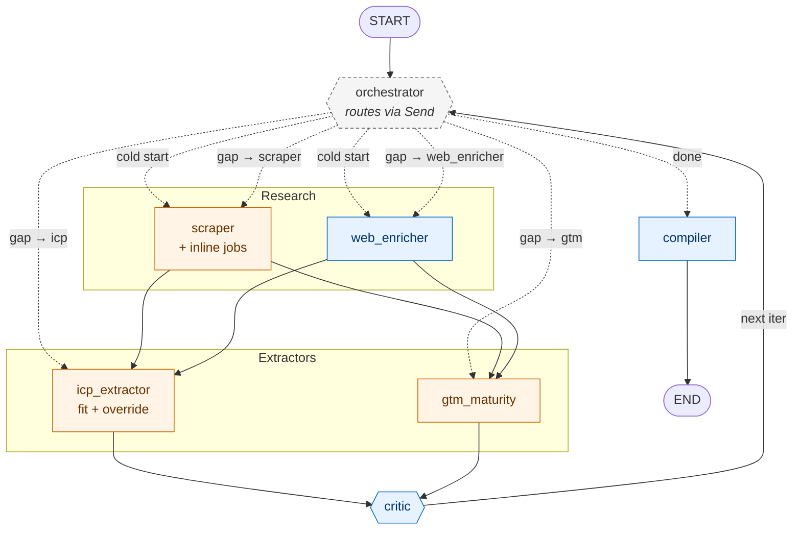

# Account Research Agent

A LangGraph agent that takes a company domain and returns a decision-ready account brief — scored against a configurable ICP, with self-correcting research loops and a code-enforced disqualifier policy.

Built as an architect-level demonstration of agentic GTM patterns. Not a Clay table dressed up as an agent.

```bash
python run.py vercel.com
# -> outputs/vercel.com.md
```

## What you get

Here's the brief the agent produced for `vercel.com` — a textbook disqualifier case (Series F, well past the Series A–C target) that the agent flagged AND chose to override with cited evidence:

> **ICP fit:** 4.0/5 (Series F · B2B SaaS - developer platform / AI cloud infrastructure) · confidence 0.82
> **Recommendation:** Pursue — confirmed GTM Engineer JD + new COO signals live buying window.
>
> ## Evidence
> - Careers page lists open **GTM Engineer** role (Austin, NYC, SF) — direct buyer-side intent
> - COO Jeanne Grosser (ex-Stripe CBO, hired 2025) published GTM modernization thesis
> - Internal **Vercel Agent** deployment confirms they fund and trust agentic automation
> - $200M ARR, 37 quota-carrying reps, ~823 employees — lean GTM org at scale
> - No public evidence of dedicated RevOps team or modern enrichment stack
>
> ## Disqualifier override
> Series F stage hit the `series-d-plus-legacy` disqualifier, but the override holds: the GTM Engineer JD, Grosser's GTM modernization mandate, and internal Vercel Agent investment are concrete signals that this account is actively *building* — not maintaining — GTM infrastructure. Disqualifiers overridden: `series-d-plus-legacy`.

A Clay table can score 4.0. It cannot tell you *why it overrode the rule*. That gap is what this project demonstrates.

### Sample briefs

Three runs in [`outputs/samples/`](outputs/samples/) showing the agent's reasoning across edge cases — the cases where simple scoring breaks down:

- [`peer-not-buyer-clay.md`](outputs/samples/peer-not-buyer-clay.md) — Clay scores **0/5 Pass**. The agent identifies Clay as the *vendor* of the GTM tooling Anderson uses, not a *buyer* of GTM Engineering services. A naive ICP-fit agent would mark Clay as a strong fit ("Series C B2B SaaS, AI-native, hiring GTM Engineers"); this one catches the structural inversion.
- [`peer-not-buyer-apollo.md`](outputs/samples/peer-not-buyer-apollo.md) — Apollo scores **1/5 Pass**, same logic. Apollo *ships* agentic GTM as a product. Same surface signals as Clay, same correct read.
- [`disqualified-deloitte.md`](outputs/samples/disqualified-deloitte.md) — Deloitte scores **0/5 Pass**. Consultancy disqualifier honored cleanly. The straightforward case included as a control.

Together they show the agent making the distinction a Clay table can't: not just "does this company match the ICP keywords" but "does this company actually buy what we're selling, given the structure of the market." That's the architect-vs-operator signal.

## Architecture



The architecturally interesting parts:

- **`critic` emits structured `Gap` objects with a `target_node` field.** When research is weak, the critic doesn't just complain — it identifies *which node* should re-fire to close the gap, and the orchestrator dispatches selectively via LangGraph's `Send` API. Self-correcting research, not one-shot enrichment.
- **Hybrid disqualifier policy with code-enforced clamp.** The agent may flag a disqualifier AND override it — but only if it populates `override_reasoning` with a cited signal. Otherwise code clamps `fit_score ≤ 1` regardless of what the LLM emits. The brief surfaces overrides in a dedicated section so the reader can audit the judgment.
- **LangGraph for orchestration, Anthropic SDK direct for leaf nodes.** No LangChain wrappers. The framework earns its weight only on the state machine + critic loop; everything else is raw SDK.

Full design rationale in [docs/architecture.md](docs/architecture.md).

## Quickstart

```bash
git clone https://github.com/aehirota/account-research-agent.git
cd account-research-agent
python3 -m venv .venv && source .venv/bin/activate
pip install -r requirements.txt
cp .env.example .env
# Fill in ANTHROPIC_API_KEY and FIRECRAWL_API_KEY

python run.py vercel.com           # single account
python run.py --batch domains.txt  # batch (resumable on crash)
python evals/eval_runner.py        # 20-account golden eval
```

Cost: ~$0.30 per account. Full 20-account eval ≈ $5–8.

Operational details in [CLAUDE.md](CLAUDE.md).

## Built with

- [LangGraph](https://langchain-ai.github.io/langgraph/) for orchestration (Send API for conditional parallel fanout, custom state reducers)
- [Anthropic SDK](https://docs.claude.com/en/api/overview) direct — Sonnet 4.6 for reasoning, Haiku 4.5 for structured extraction
- [Pydantic](https://docs.pydantic.dev/) for typed state + structured tool-call outputs
- [Firecrawl](https://www.firecrawl.dev/) for managed scraping
- [LangSmith](https://www.langchain.com/langsmith) (optional) for tracing

## Status & known issues

This is in-progress portfolio work, not a polished product. See [KNOWN_ISSUES.md](KNOWN_ISSUES.md) for current limitations — most notably an ongoing eval golden re-curation after the agent caught a curation mistake (vendor-vs-buyer mislabeling) that's now documented as one of the project's sharpest demonstrations.

## License

MIT — see [LICENSE](LICENSE).

## About

Built by [Anderson Hirota](https://linkedin.com/in/andersonhirota), GTM Engineer / Sales Systems Architect at [GTM Systems Lab](https://gtmsystemslab.com).
