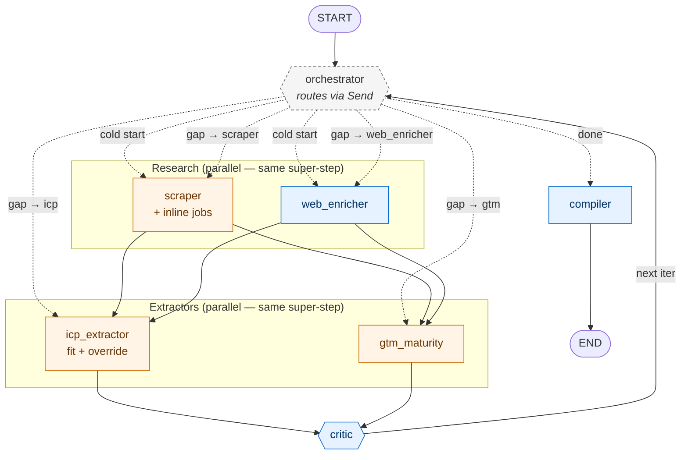

# Account Research Agent — Architecture

A LangGraph agent that takes a company domain and produces a decision-ready account brief scored against a configurable ICP. Built to demonstrate **architect-level** agentic GTM patterns — not a Clay table dressed up as an agent.

## What it does

Input: one domain (e.g. `vercel.com`).
Output: a one-screen markdown brief — ICP fit score with evidence, GTM maturity assessment, an explicit recommendation (`pursue` / `nurture` / `pass` / `research-more`), and a pitch angle grounded in the evidence. If a disqualifier hits, the brief either honors it (recommend pass) or shows a dedicated **Disqualifier override** section explaining the override reasoning so the reader can audit the call.

## Architecture



**Reading the diagram:** Dashed arrows show the conditional `Send` dispatch from the `orchestrator` — on cold start it fires research nodes, on a critic-driven re-fire it dispatches only the nodes that own each gap, on threshold/iter-max it goes straight to compiler. Solid arrows are static LangGraph edges. Blue nodes call Sonnet 4.6, orange nodes call Haiku 4.5. Subgraphs group nodes that run in the same super-step.

### What each node does

| Node | Model | Reads | Writes |
|---|---|---|---|
| `scraper` | Haiku (for inline jobs extract) | `domain` | `raw.site`, `raw.jobs` |
| `web_enricher` | Sonnet + native `web_search` tool | `domain` | `raw.web` |
| `icp_extractor` | Haiku, structured output | `raw.*` | `signals.icp_fit` (incl. `override_reasoning` + code clamp) |
| `gtm_maturity` | Haiku, structured output | `raw.*` | `signals.gtm_maturity` |
| `critic` | Sonnet, structured output | full state | `critique.score`, `critique.gaps[].target_node` |
| `compiler` | Sonnet | full state | `outputs/{domain}.md` + `summary.json` |

## Three design decisions worth defending

### 1. LangGraph for the critic loop, Anthropic SDK direct for the leaf nodes

LangChain has commoditized — wrapping every LLM call in a `ChatPromptTemplate` adds debt without earning its weight. LangGraph is different: it earns its keep when you have **branching state machines, multi-agent coordination, or eval loops** — exactly what this agent has. So the orchestration runs on LangGraph; the individual node bodies call the Anthropic SDK directly (forced tool use for structured output, native `web_search` tool for the research node). No LangChain wrappers, no abstraction debt, no provider lock-in surprise.

If the Claude Agent SDK and OpenAI Agents SDK absorb LangGraph's territory over the next 18 months, the same patterns port over in a weekend — the architecture is the asset, not the framework.

### 2. The critic loop routes gaps back to *specific* nodes

The critic doesn't just score the brief. It emits structured `Gap` objects:

```python
class Gap(BaseModel):
    dimension: str        # e.g. "funding_stage", "ICP_fit_reasoning"
    target_node: Literal["scraper", "web_enricher", "icp_extractor", "gtm_maturity"]
    hint: str             # specific instruction for the re-run
    severity: float       # 0-1; mandatory gaps re-fire, soft gaps don't
```

The orchestrator reads these and re-dispatches **only the nodes that own the missing signal** — via LangGraph's `Send` API, in parallel where possible. A funding gap re-fires `web_enricher` with a specific search hint; a missing pricing page re-fires `scraper` with `/pricing` appended; an "ICP reasoning weak despite enough data" gap re-fires only `icp_extractor`. This is the difference between *self-correcting research* and *one-shot enrichment with prayer*.

Hard cap at 3 iterations. If the critic still flags gaps at iter 3, the brief emits with a "known gaps" footer rather than looping forever.

### 3. Hybrid disqualifier policy with code-enforced clamp

A naive ICP-fit agent treats disqualifiers as binary: agency → score 1, done. But real GTM judgment is more nuanced — a Series F company normally disqualifies, *except* when their COO is publicly building the exact role you sell into.

The agent has two paths:

| Path | When | Result |
|---|---|---|
| **A — Honor** (default) | Disqualifier hit, no override reasoning | Code clamps `fit_score ≤ 1`. Brief recommends pass. |
| **B — Override** | Disqualifier hit, **override_reasoning** populated with a concrete, dated, source-attributable signal | `fit_score` may be 3–5. Brief shows a dedicated "Disqualifier override" section. |

The clamp is enforced in code, not in the prompt — the LLM cannot accidentally skip the rule. If the agent wants to override a disqualifier, it must explicitly own the override by populating the field. The brief then surfaces the override transparently so the reader can audit the agent's reasoning.

This is the architect move. An operator-level agent gives you a score; an architect-level agent gives you a score, the rule, the override, and the reasoning — and the reader retains agency over the final call.

## The Vercel example

Run the agent on `vercel.com` and it produces this fragment:

> **ICP fit:** 4.0/5 (Series F · B2B SaaS - developer platform / AI cloud infrastructure) · confidence 0.82
> **Recommendation:** Pursue — confirmed GTM Engineer JD + new COO signals live buying window.
>
> **Disqualifier override**
> Series F stage hit the `series-d-plus-legacy` disqualifier, but the override holds: the GTM Engineer JD (live, multi-city), Grosser's documented GTM modernization mandate, and internal Vercel Agent investment are concrete, dated signals that this account is actively building — not maintaining — GTM infrastructure. Disqualifiers overridden: `series-d-plus-legacy`.

The agent flagged the disqualifier, then made an explicit, evidence-backed call to override it. A Clay table can score 4.0; it cannot tell you *why it overrode the rule*. That's the architect-vs-operator divide made concrete.

## Cost and performance

- **~$0.25–$0.40 per account** (Sonnet for reasoning nodes, Haiku for extraction, ~5 web searches at $0.05). Verified on multiple runs against the goldens.
- **~1–2 minutes wall-clock** per account, depending on critic iterations (typically 2).
- Full 20-account eval ≈ **$5–$8**, ~15 minutes.

By comparison, Clay credits for equivalent enrichment depth run $0.30–$0.80 per account depending on the columns. The agent's marginal cost is in the same ballpark, but it produces *reasoning* and *self-correction* that Clay's column-based model can't.

## Stack

- **LangGraph** (orchestration) — `Send` API for conditional parallel fanout; `Annotated` state with custom reducers so parallel writes to the same key merge instead of clobber.
- **Anthropic SDK direct** — Sonnet 4.6 for `web_enricher` / `critic` / `compiler`; Haiku 4.5 for the structured extraction nodes.
- **Pydantic** — typed state schema + structured tool-call outputs; defensive `_heal_input()` step repairs Haiku's occasional JSON-stringified-list quirk before validation.
- **Firecrawl** — managed scraping; per-page soft-fail so a 404 on `/customers` doesn't crash the run.
- **Anthropic web_search** — native server-side tool, no Tavily/Brave key needed.
- **LangSmith** (optional) — full graph trace + per-node latency + token cost. Set `LANGSMITH_TRACING=true` to enable.

## Source

[github.com/.../account-research-agent](.) — the repo. Configurable via [config.yaml](../config.yaml) (ICP definition + model + graph tuning knobs); prompts in [prompts/](../prompts/) are version-controlled markdown. Run with `python run.py <domain>`.
